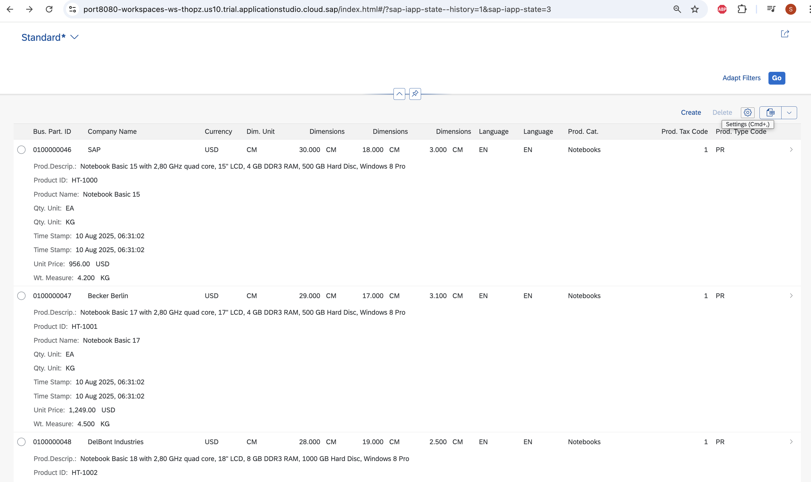
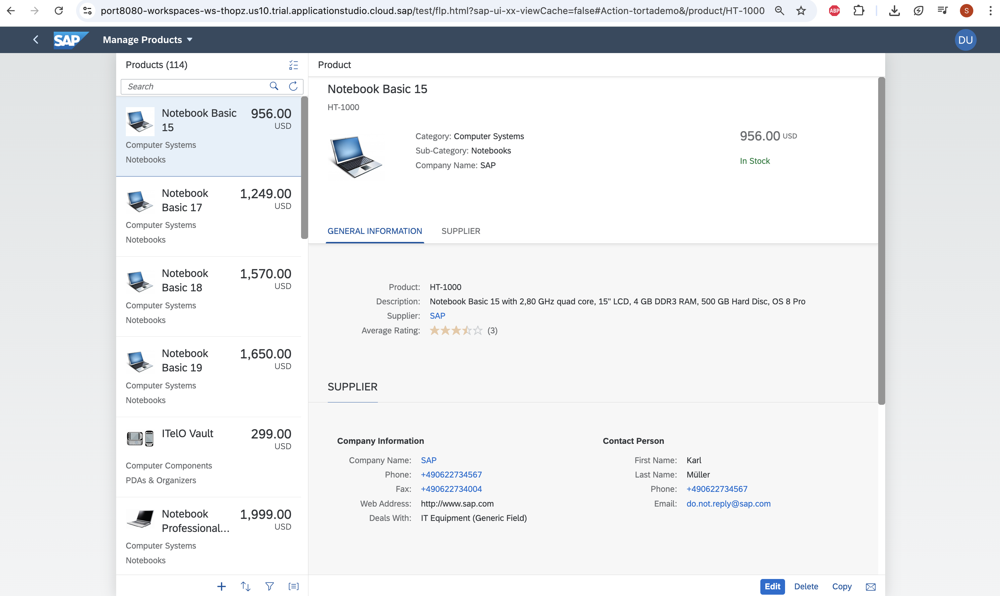
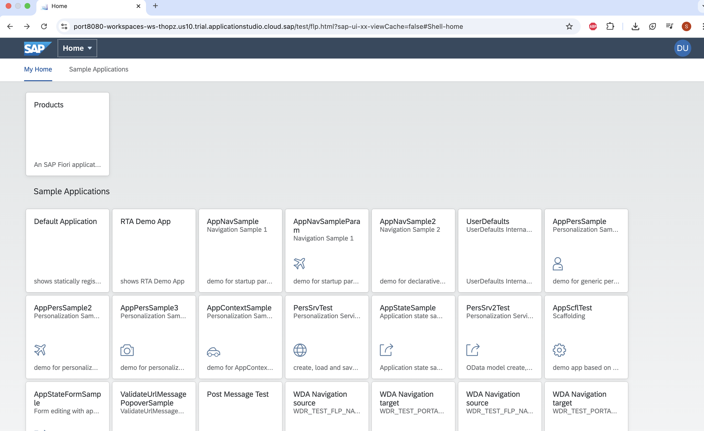
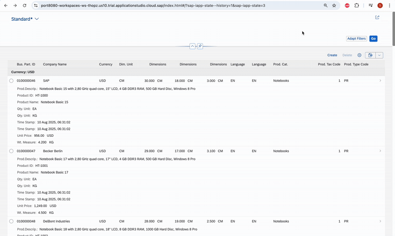

# Fiori_App

A SAPUI5 / Fiori application integrated with SAP S/4HANA backend via OData services, demonstrating smart controls, annotations, and enterprise-grade UI features.

---

## Features

- Uses SAP Fiori Elements annotations (`UI.LineItem`, `Org.OData.Capabilities.V1.SortRestrictions`) for declarative UI definition  
- SmartFilterBar and SmartTable components for easy filtering and responsive data display  
- Custom filters implemented via controller logic (e.g., filtering by category)  
- Dialog controls for user interaction (approval confirmation)  
- Integration with SAP S/4HANA OData backend (`ProductSet` entity)  
- Responsive and modular UI using XML Views and MVC pattern  

---
## Screenshots and GIF

